# LLM Compiler Optimizer

Graph-based **compiler optimization for LLM-style models**: fusion, scheduling,
partitioning, and learned search on a computation-graph IR — plus a small
**MNIST train → export → compile** experiment.

*A beginner-friendly walkthrough of what this project does, why it
exists, what goes in, how it works, and what comes out.*

## Quick start

```powershell
git clone https://github.com/santhansai11/compiler-optimization-for-llm.git
cd compiler-optimization-for-llm
.\run-server.bat
```

Then open **http://localhost:8501**. The batch file creates `.venv312` if needed,
installs `requirements.txt`, and starts Streamlit.

CLI (after the venv exists):

```powershell
.\.venv312\Scripts\python.exe main.py
.\.venv312\Scripts\python.exe main.py --train
```

Graphviz (`dot.exe`) must be on `PATH` for the graph charts
(typical install: `C:\Program Files\Graphviz\bin`).

---

## Table of Contents

1. [Background: the ideas you need first](#1-background)
2. [What are we building?](#2-what-are-we-building)
3. [What is the input?](#3-inputs)
4. [How the original graph is formed](#4-original-graph)
5. [Methodology — the 9 techniques explained](#5-methodology)
6. [How we measure: the 10 output metrics](#6-metrics)
7. [Outputs — what you actually see](#7-outputs)
8. [Results summary](#8-results)
9. [Honest limitations](#9-limitations)
10. [How to run it & project structure](#10-running)
11. [Experimental setup](#11-experimental-setup)
12. [Research & discussion](#12-research-discussion)
13. [Training on a real dataset (MNIST)](#13-training)

---

## 1. Background <a name="1-background"></a>

### 1.1 What is a neural network?

A neural network is a big mathematical function made of simple building
blocks. Data flows in one side, and each block does a small piece of
math — mostly **matrix multiplications** (multiplying grids of numbers)
and element-wise operations — until a prediction comes out. The
"learning" part of AI is finding good numbers (*weights*) inside those
matrices.

### 1.2 What is an LLM?

An **LLM (Large Language Model)** — like GPT, LLaMA or Gemini — is a
neural network specialised for text:

- Text is chopped into **tokens** (word pieces); each token becomes a
  list of numbers called a **vector / embedding**.
- The heart of every LLM is the **Transformer block**, and the heart of
  attention is: three matmuls to make **Q, K, V** projections, a score
  matrix `Q·Kᵀ`, a **scale** (÷√d), a **softmax** (scores →
  percentages), and a final matmul with V. That is "how much should I
  care about each earlier token".
- Each block also has a small **feed-forward network (FFN)** — two big
  matmuls with a **GELU** activation between — plus **residual adds**
  and **LayerNorm** (a stabiliser).
- An LLM = many such blocks stacked (real models: 32–100+; our demo: 2)
  with millions–billions of weights.

### 1.3 Inference, and why it is slow and expensive

**Training** builds the model once; **inference** is *using* it — every
chat reply, every autocomplete. Inference is where the money goes:

- An LLM is a **long chain of hundreds/thousands of small math
  operations** that mostly must run in order.
- On a GPU each operation is a **kernel** (a small program). Launching
  one costs fixed overhead (~5–15 µs) even when the math is tiny —
  hundreds of launches means lots of *waiting*, not computing.
- Every operation writes its result to memory and the next one reads it
  back. For small/medium models **moving data** costs more than the
  math (GPUs are memory-bandwidth bound).
- Real compilers therefore shrink the work: fewer, bigger kernels that
  keep data in fast on-chip memory.

### 1.4 What is a computation graph?

Before a network runs, frameworks (PyTorch, TensorFlow, ONNX) represent
it as a **computation graph**: a directed diagram where

- **nodes = operations** ("multiply these matrices", "softmax this"),
  and
- **edges = tensor dependencies** ("that output feeds this node").

Think of a recipe where every step is a box and arrows show which dish
feeds which step. *Execution must respect the arrows*, but independent
branches can run in parallel.

### 1.5 What is a compiler, and why does an LLM need one?

A compiler (like GCC for C) translates code to machine code and
**optimises it** without changing what the program *does*. An ML
compiler (XLA, TensorRT, TVM, MLGO…) does the same for computation
graphs by running **passes** — each pass rewrites or analyses the graph:

- **operator fusion** — merge 2–3 ops into one kernel so intermediates
  never touch main memory;
- **constant folding** — precompute what is already known;
- **dead-code elimination (DCE)** — drop ops nobody uses;
- **common-subexpression elimination (CSE)** — compute repeated things
  once;
- **scheduling** — order ops to hide latency; **partitioning** — split
  a graph across GPUs.

The golden rule: the optimised graph must compute **the same answers**
— which is why we measure *accuracy preservation*.

This project builds exactly such a compiler in miniature, so every idea
is visible and measurable.

---

## 2. What are we building? <a name="2-what-are-we-building"></a>

**One sentence:** a working teaching compiler that takes a Transformer
(LLM) computation graph, rewrites it through 6 classic optimisation
passes plus 3 AI-guided search techniques, and proves the result with
10 measured/modeled metrics — including proof that the optimised model
still produces *identical* outputs.

```
original graph (42 ops)
 │ 1. Graph Normalization        canonicalize, fold constants, CSE, DCE, shapes
 │ 2. Attention Canonicalization  7 attention ops → 1 fused op
 │ 3. Semantic Operator Merging   MatMul+Add→GEMM, fusion chains
 │ 4. DAGS Scheduling             levels, critical path, execution order
 │ 5/6. Graph/Hypergraph Partitioning   split across devices
 │ 7. GNN scorer                  learns which graphs optimize well
 │ 8. RL pass-order search        learns which passes to use
 │ 9. Neuro-symbolic search       symbolic rules + learned guidance
 ▼
optimised graph (14 ops) → executed & measured → 10-metric dashboard
```

Everything runs in pure Python/NumPy — no GPU or heavy framework
needed — while real-GPU numbers are estimated with a documented cost
model (see §6.3).

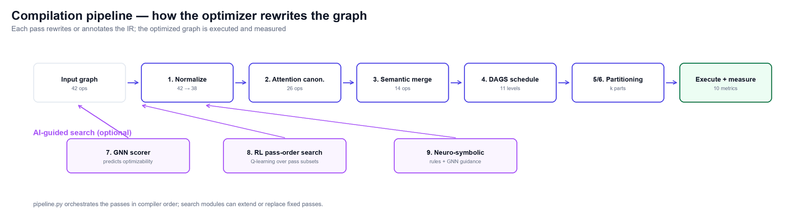

*Figure 1 — The 9 techniques and where they sit in the pipeline. The
first six rewrite/annotate the graph; the last three are the learned
searches that can extend or replace fixed passes.*

---

## 3. What is the input? <a name="3-inputs"></a>

| Input | What it is | Where it comes from |
|---|---|---|
| **Model graph** | A 2-block (or 4-block) Transformer computation graph — 42 operations | Built by `models/transformer.py` (see §4) |
| **Constants** | Positional-embedding table and a logit bias — real tensors stored in the IR | Generated deterministically in the model builder |
| **Workload config** | `batch=4, seq=32, d_model=64` — tensor shapes for the executor and shape inference | `graph.meta["config"]` |
| **User choices** | Which passes run, partitioning mode + count, RL / neuro-symbolic toggles | Streamlit sidebar / CLI |
| **Weights** | Matrices inside matmuls | Derived deterministically from op names (fixed seed). In production these come from a real exported model (ONNX / Torch FX); the IR is designed so such an export could feed it. |

---

## 4. How the original graph is formed <a name="4-original-graph"></a>

`ir/graph.py` defines `ComputationGraph` — a wrapper around a NetworkX
**directed acyclic graph (DAG)**. `add_operation(name, op_type, **attrs)`
creates a node (attributes like `factor`, `value`, `is_output` travel
with it); `add_dependency(a, b)` creates the arrow "a's tensor flows
into b".

`models/transformer.py` then builds a real Transformer, block by block.
One block:

```
              source (previous block output)
              ├──► Q_Projection (MatMul) ──┐
              ├──► K_Projection (MatMul) ──┤
              ├──► V_Projection (MatMul) ──┤
              │                            ▼
              │                     QK_Score (MatMul)
              │                            ▼
              │                      Scale (×1/√d)
              │                            ▼
              │                      Softmax
              │                            ▼
              └────────────────────► Attention_Output (MatMul)
                                           ▼
                   Residual_Add  ◄── (AV + source)
                     ▼
                   LayerNorm
                     ▼
        FFN_Linear → FFN_Bias → GELU → FFN_Output → FFN_Bias_Output
                     ▼
        FFN_Residual_Add → FFN_LayerNorm → Dropout (Identity)
```

Two blocks are chained, wrapped with an embedding add
(`Input + positional constant`), a final `Logits` matmul + bias (marked
as the **output** with `is_output=True`), and one deliberately **dead
branch** (`Unused_Debug`) so the normalizer has real work to do.

**Total: 42 operations, 50 dependencies.** The graph intentionally
contains the classic patterns — a full attention block per layer,
matmul + bias-add pairs, Add→LayerNorm pairs, Identity ops — so every
compiler pass has something real to find.

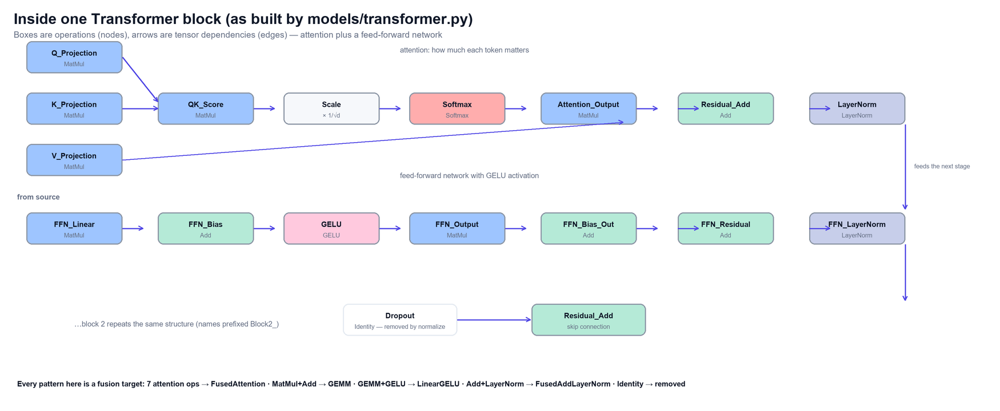

*Figure 2 — One Transformer block exactly as the model builder
constructs it: attention (Q/K/V → QKᵀ → Scale → Softmax → AV) and the
feed-forward network (Linear → GELU → Output → bias → residual).*

### 4.1 The four architectures implemented

`models/architectures.py` provides several architectures; **the same
compiler pipeline and the same 10 metrics are applied to each**, which
is the architecture-comparison experiment:

| Architecture | Ops (orig → opt) | GRR | Fusions found | Modeled speedup | Accuracy |
|---|---|---|---|---|---|
| **Post-LN Transformer** (reference) | 42 → 14 | 66.7% | 2 attn + 11 merges | 1.73× | 100% |
| **Pre-LN Transformer** (GPT-style) | 36 → 16 | 55.6% | 2 attn + 8 merges | 1.67× | 100% |
| **Post-LN + ReLU FFN** | 42 → 14 | 66.7% | 2 attn + 11 merges | 1.74× | 100% |
| **MLP classifier** (784-256-64-10) | 13 → 5 | 61.5% | 5 merges | 1.08× | 100% |

The comparison itself is informative: **pre-LN fuses fewer ops** than
post-LN (its residuals feed Adds directly, so the Add+LayerNorm fusion
does not apply — exactly the pattern-dependence real compilers face),
and the MLP has no attention to canonicalize.

### 4.2 Mathematical formulation (the model, in equations)

**Attention** (the core of every LLM block):

$$\mathrm{Attention}(Q,K,V)=\mathrm{softmax}\!\left(\frac{QK^{\top}}{\sqrt{d_k}}\right)V,
\qquad Q=XW_Q,\; K=XW_K,\; V=XW_V$$

**LayerNorm** (stabiliser between blocks):

$$\mathrm{LN}(x)=\frac{x-\mu}{\sqrt{\sigma^{2}+\epsilon}}\odot\gamma+\beta,
\qquad \mu=\frac{1}{d}\sum_{i=1}^{d}x_i,\;\; \sigma^2=\frac{1}{d}\sum_{i=1}^{d}(x_i-\mu)^2$$

**Activations** (the non-linearity after each linear layer):

$$\mathrm{GELU}(x)=0.5\,x\left[1+\tanh\!\left(\sqrt{2/\pi}\,(x+0.044715\,x^{3})\right)\right],
\qquad \mathrm{ReLU}(x)=\max(0,x)$$

**Feed-forward / dense layer** (what our **GEMM** fusion produces):

$$Y = XW + b$$

**Softmax + cross-entropy** (training objective for the classifier):

$$\mathrm{softmax}(z)_i=\frac{e^{z_i}}{\sum_{j} e^{z_j}},
\qquad \mathcal{L}=-\frac{1}{N}\sum_{n=1}^{N}\sum_{c=1}^{C} y_{n,c}\,\log\hat{y}_{n,c}$$

**Backpropagation** (chain rule through a layer, ReLU derivative):

$$\delta^{(l)}=\left(\delta^{(l+1)}W^{(l+1)\top}\right)\odot \mathbb{1}\!\left[z^{(l)}>0\right],
\qquad \frac{\partial \mathcal{L}}{\partial W^{(l)}}=\delta^{(l+1)\top} a^{(l)}$$

**Adam update** (the optimizer used for training):

$$m_t=\beta_1 m_{t-1}+(1-\beta_1)g_t,\;\; v_t=\beta_2 v_{t-1}+(1-\beta_2)g_t^2,\;\;
\theta \leftarrow \theta-\alpha\,\hat{m}_t/(\sqrt{\hat{v}_t}+\epsilon)$$

**Compiler-side math**: sequential vs level-parallel latency (the DAGS
cost model) and the GNN/Q-learning objectives:

$$T_{\text{seq}}=\sum_{v\in G} t(v)+n\cdot t_{\text{launch}},
\qquad T_{\text{par}}=\sum_{\ell}\max_{v\in\ell} t(v)+n\cdot t_{\text{launch}}$$

$$H^{(l+1)}=\mathrm{ReLU}\!\left(H^{(l)}+\hat{A}H^{(l)}W^{(l)}\right),
\quad \hat{A}=D^{-1/2}(A+I)D^{-1/2}$$

$$Q(s,a)\leftarrow Q(s,a)+\alpha\left[r+\gamma\max_{a'}Q(s',a')-Q(s,a)\right]$$

---

## 5. Methodology <a name="5-methodology"></a>

Each subsection: what the technique is (with an analogy) → what our
code actually does → what it changed on our graph.

### 5.1 Graph Normalization (`passes/normalize.py`) — *tidy the workshop*

Like a chef organising the kitchen before cooking. Six steps:

1. **Canonicalization** — standardise names ("matmul"→"MatMul") so
   later passes can rely on spelling.
2. **Identity elimination** — `Identity(x) = x` ops (like our Dropout
   placeholder) are rewired away: consumers read the producer's output
   directly. *2 removed.*
3. **Constant folding** — if an op's inputs are all constants, compute
   it **at compile time** (`Scale(constant 0.5)` → a precomputed
   constant). Fewer runtime ops, same result. *2 folded.*
4. **CSE** — two ops computing the identical thing become one.
   *Parameterised ops (MatMul — whose weights the signature can't see)
   are excluded, otherwise Q/K/V projections would wrongly merge.*
5. **DCE** — remove ops no output depends on (our dead debug branch and
   the orphaned constant). *2 removed.*
6. **Shape/dtype inference** — every node learns its tensor shape
   (incl. the Q@Kᵀ rule → `(batch, seq, seq)`), like a type checker.

**Result: 42 → 38 ops**, DAG preserved.

### 5.2 Attention Graph Canonicalization (`passes/canonicalize.py`) —
*the FlashAttention idea*

Real runtimes (FlashAttention, `F.scaled_dot_product_attention`) execute
the whole attention sandwich as **one** highly-optimised kernel. This
pass **pattern-matches** the 7-node shape

```
Q,K,V (MatMul×3) → QKᵀ → Scale → Softmax → AV
```

with strict wiring checks (each node used only inside the pattern),
then replaces it with a single **`FusedAttention`** operator. Provenance
(`fused_from`) and the scale `factor` are carried into the fused node.

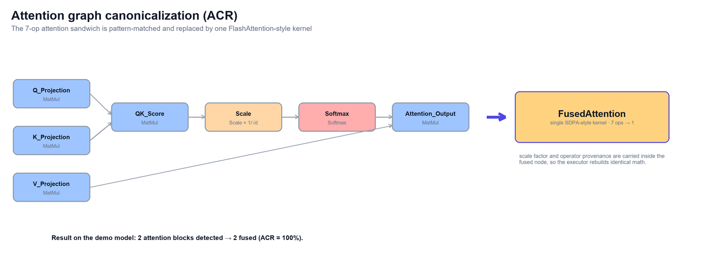

*Figure 3 — The 7-op attention sandwich → one FlashAttention-style
kernel. The scale factor and operator provenance travel with the fused
node, so the executor rebuilds identical math.*

**Result: 2 attention blocks found → 2 fused (ACR 100%), 26 ops.**

### 5.3 Semantic Operator Merging (`passes/merge.py`) — *kernel fusion*

The classic fusion table, applied to fixpoint:

| Pattern | Fused kernel | Real-world analogue |
|---|---|---|
| MatMul + Add | **GEMM** | cuBLAS GEMM with bias |
| GEMM/MatMul + GELU | **LinearGELU** | fused Linear+activation |
| Add + LayerNorm | **FusedAddLayerNorm** | fused residual+norm |
| Scale + Softmax | **FusedScaleSoftmax** | fused softmax path |

Rules: the producer may have exactly one consumer, the consumer one
producer — except GEMM may additionally **absorb a constant bias**
(the constant's value becomes an attribute and the node disappears).
Absorbed operators are recorded in `fused_from` so the executor can
rebuild identical math.

**Result: 11 fusions (GEMM×5, LinearGELU×2, FusedAddLayerNorm×4),
26 → 14 ops.** Idempotent — running it again changes nothing.

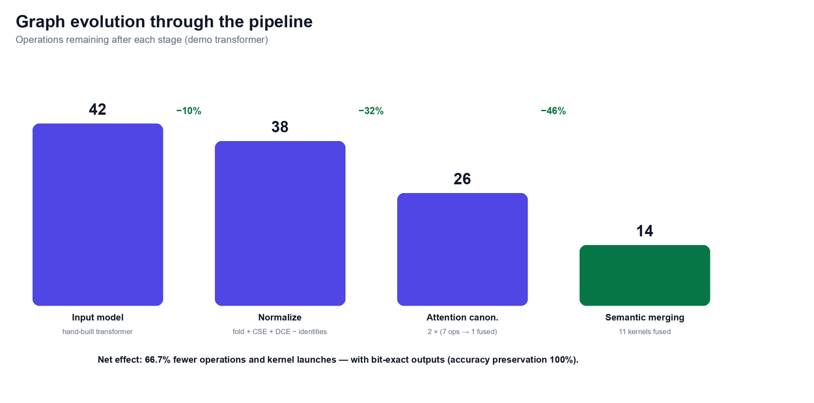

*Figure 4 — Operations remaining after each pipeline stage: 42 → 38 →
26 → 14 (–66.7%).*

### 5.4 Dependency-Aware Graph Scheduling — DAGS (`passes/schedule.py`)
*the flight-control tower*

Given the DAG, in what order should ops run, and what can run **in
parallel**? DAGS computes:

- **dependency levels** — an op's level = 1 + max level of its inputs
  (like course prerequisites);
- **critical path** — for each op, the longest weighted chain from it to
  any output (the "longest queue" that decides minimum total time);
- a deterministic **list schedule** — ops sorted by (level,
  critical-path priority), annotated on every node as
  `schedule_order` / `schedule_level`.

Scheduling is *analysis*: it changes no nodes but everything downstream
(parallel-latency estimates, buffer-reuse planning, partition
colouring) uses it. On our graph: 14 ops → **11 levels**, avg
parallelism ~1.3, and a modeled level-parallel makespan far below the
sequential sum.

### 5.5 Graph Partitioning (`passes/partition.py`) — *split across
devices*

Big models don't fit one GPU. Partitioning assigns each op a
**partition id** (future device). Ours detects communities with
**greedy modularity** (nodes that talk to each other belong together —
like grouping friends), then forces exactly *k* parts by merging the
smallest / splitting the largest communities (deterministic BFS
bisection). Quality is reported as **cut edges** (dependencies crossing
devices = slow communication) and a **balance ratio**. Structure is
never mutated — it is pure annotation. On the 38-op graph (k=2):
parts **[22, 16]**, only **2 cut edges**, balance 1.375.

### 5.6 Hypergraph Partitioning (`passes/partition.py`) — *better cuts
with group-wires*

A normal edge connects 2 nodes, but one op feeding 4 consumers is
really a **hyperedge** (a wire with many pins). Hypergraph mode builds
nets from multi-input fan-in cones and multi-consumer fan-out sets,
converts them to a weighted connection graph, partitions that, and
reports **cut hyperedges** + **communication volume** (pins spread
across devices). On the fused graph (k=2): **9 nets, 2 cut, comm 2**.

### 5.7 Graph Neural Network scorer (`search/gnn.py`) — *a critic that
has seen many graphs*

A GNN learns from graph *shape*, not just single nodes. Our NumPy GNN:

1. **Features** per node: one-hot op type (17 vocab) + 4 scalars
   (log-degrees, is-fused flag, latency class) = 21 dims.
2. **Message passing**: features propagate over the normalized
   adjacency for 2 rounds (`H = relu(H + ·H·W)`) — every node ends up
   knowing about its neighbourhood.
3. **Readout**: mean-pool all nodes → one graph embedding → a trained
   **ridge-regression head** predicts *"how much speedup can the
   optimizer extract from this graph?"*.

Training: 36 synthetic DAGs (mixing attention motifs and random ops —
labels = the cost-model speedup the pipeline actually achieves), each
contributing **two samples** (unfused + fused, same label) so the head
sees both worlds. Weights cached in `gnn_weights.npz`.

### 5.8 Reinforcement Learning pass-order search (`search/rl.py`) —
*learning which tools to use*

RL = trial-and-error learning with rewards. Our environment:

- **State**: which passes were applied so far (subset of
  normalize/canonicalize/merge/schedule/partition).
- **Action**: apply one remaining pass, or stop.
- **Reward**: modeled speedup − 0.05 per pass used (rewards results,
  discourages complexity).

A tabular **Q-learning** agent runs ε-greedy episodes (80, ε 0.35→0.05,
γ 0.9): every action's value `Q[state][action]` is nudged toward
`reward + γ·max Q(next)`. Outcome on our model: it learns to recommend
**normalize → canonicalize → merge** (reward **1.583**, 18 Q-states
explored) — schedule/partition don't pay for their complexity cost on
this small graph.

### 5.9 Neuro-symbolic search (`search/neuro_symbolic.py`,
`search/rewrites.py`) — *rules + intuition*

Symbolic = explicit logic (rewrites like `Scale(Scale(x)) → Scale(x)`);
neural = learned intuition. Five **rewrite rules** are defined
(eliminate-identity, fold-constant, combine-nested-scales, CSE,
fuse-matmul-add). Each search round: enumerate **all** rule matches,
simulate each on a graph copy, score candidates with a **hybrid
objective** (0.7 × deterministic cost model + 0.3 × GNN prediction −
node-count penalty) and apply the best. This mirrors real learned
compilers (MLGO/TASO): *the model proposes and ranks, the cost model
validates*. Given the unfused canonical graph it applies **4 fusions
(26 → 22 nodes)** and its outputs stay bit-exact.

### 5.10 Pipeline order — why this sequence?

```
normalize → canonicalize → merge → neuro-symbolic → DAGS → partition
```

Normalize first (clean names/patterns); canonicalize **before** merge
(else Scale+Softmax fusion would destroy the attention pattern);
merge/NS before scheduling (fewer ops to schedule); schedule before
partition (levels + partitions co-exist for the executor and visuals).

---

## 6. How we measure: the 10 output metrics <a name="6-metrics"></a>

Three sources of truth, kept deliberately separate:

1. **Measured** — `utils/executor.py` actually *executes* both graphs
   op-by-op in NumPy (batch 4, seq 32, d_model 64) with deterministic
   per-op weights; fused operators rebuild the exact same math from
   their `fused_from` provenance. Latency = best of 30 timed runs;
   memory = tracked live-tensor liveness.
2. **Modeled** — `utils/cost_model.py`, a documented A100-style cost
   table (per-op latency/memory, 12 µs per kernel launch), a
   level-parallel makespan from DAGS, and buffer-reuse memory
   planning. Stands in for GPU numbers on this GPU-less machine.
3. **Structural** — exact counts from the IR (nodes, launches,
   fusions).

| # | Metric | Beginner definition | Value on our demo |
|---|---|---|---|
| 1 | **Inference Latency** | Time for one forward pass | 0.566 → **0.477 ms** |
| 2 | **Throughput** | Samples processed per second | 7068 → **8382 /s** |
| 3 | **Speedup** | original latency ÷ optimized latency | **1.19× measured**, 1.73× modeled |
| 4 | **Peak GPU Memory** | Most memory alive at any instant | 0.15 → **0.09 MB** measured; 2312 → **318 MB** modeled (buffer reuse) |
| 5 | **Graph Reduction Ratio (GRR)** | Share of ops removed: (N₀−N₁)/N₀ | **66.7 %** (42→14) |
| 6 | **Model Accuracy Preservation** | Does the optimized graph compute the same thing? (outputs compared element-wise) | **100 %** — bit-exact, max diff 0.0 |
| 7 | **Operator Merge Ratio (OMR)** | Ops absorbed by fusion / original ops | **26.2 %** (11 fusions) |
| 8 | **Attention Canonicalization Rate (ACR)** | Attention subgraphs rewritten / detected | **100 %** (2/2) |
| 9 | **Kernel Launch Reduction** | Fewer launches = less overhead | **66.7 %** (42→14) |
| 10 | **Compilation Time** | Wall time of the pass pipeline itself | **3.4 ms** (+ per-pass breakdown) |

**The headline proof:** the fused 14-op graph produces *bit-identical*
outputs to the original 42-op graph — optimization without breakage.

### 6.1 The graphs, explained (a graph per metric family)

**Latency / Throughput / Peak memory** (Figure 6, left three panels):
paired bars for the original (gray) vs optimized (indigo) graph,
measured by executing both graphs on the same machine. Latency drops
because the fused graph dispatches 14 kernels instead of 42; throughput
rises proportionally (it is batch ÷ latency); peak memory falls because
fewer intermediate tensors are alive at once (liveness tracking).

**Speedup** (Figure 6 + hero banner): the ratio of the two latencies —
the single most quotable number. We report *measured* (NumPy proxy) and
*modeled* (GPU cost model) side by side and never mix them.

**Structural ratios** (Figure 8): GRR, OMR, ACR and kernel-launch
reduction as horizontal bars. These are **exact counts** from the IR —
GRR = (42−14)/42 = 66.7%, OMR = 11 fusions / 42 ops = 26.2%, ACR = 2/2
attention blocks canonicalized = 100%, kernel-launch reduction = same
arithmetic as GRR because every surviving op is one launch.

**Compilation time** (Figure 7): per-pass wall time. The full pipeline
compiles in ~3–5 ms, dominated by normalization and fusion; scheduling
and partitioning are pure analysis and cost microseconds.

**Graph evolution** (Figure 5 / fig5_stages.png): ops remaining after
each stage (42 → 38 → 26 → 14) with the per-stage reduction — the
"where did the work go" view.

**Before/after graphs** (Figure 5 / fig4_graphs.png): the actual IR
rendered before and after; fused kernels (FusedAttention, GEMM,
LinearGELU, FusedAddLayerNorm) appear as bold single nodes.

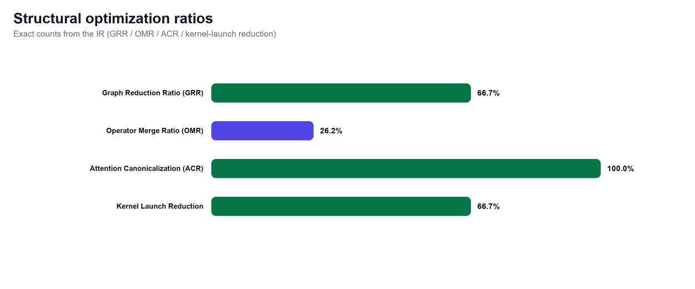

*Figure 8 — The four structural ratio metrics as horizontal bars
(GRR, OMR, ACR, kernel-launch reduction).*

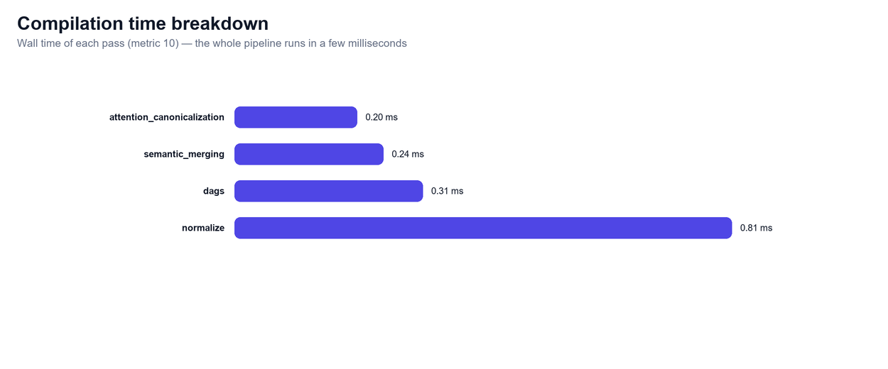

*Figure 7 — Per-pass compilation time (metric 10): the entire compile
costs only a few milliseconds.*

---

## 7. Outputs — what you actually see <a name="7-outputs"></a>

**Streamlit dashboard** (`app.py`): a gradient **hero banner** with the
headline speedup and summary chips; three rows of **metric cards** with
progress bars and colored status chips (Reduction & Fusion, Runtime,
Accuracy & Compilation); a **Metric Summary table** (every metric,
original → optimized → delta); an **operator-mix chart** (what fusion
removed); side-by-side **original vs optimized graphs** (color-coded by
op type, fused kernels bold, partition clusters and schedule order
shown); and tabs for **Pass Details** (JSON log per pass), **DAGS
Schedule** (execution-order table), **Partitions**, **Learned Search**
(GNN prediction vs actual speedup, RL recommendation, rewrite log) and
the full **CLI-style report**.

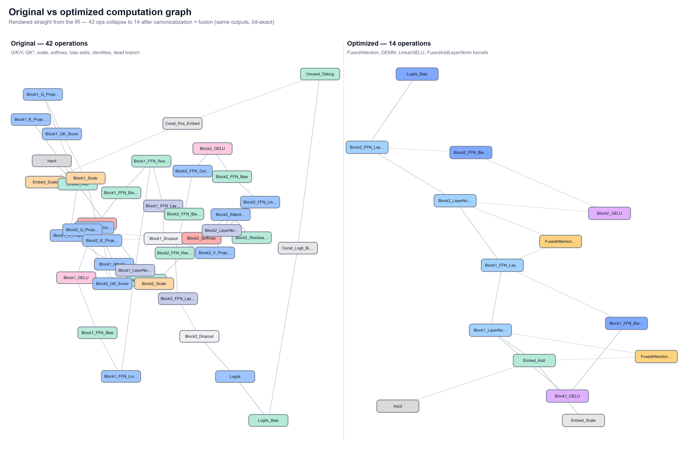

*Figure 5 — Rendered straight from the IR: the 42-op input collapses to
14 ops after canonicalization + fusion while computing bit-identical
outputs.*

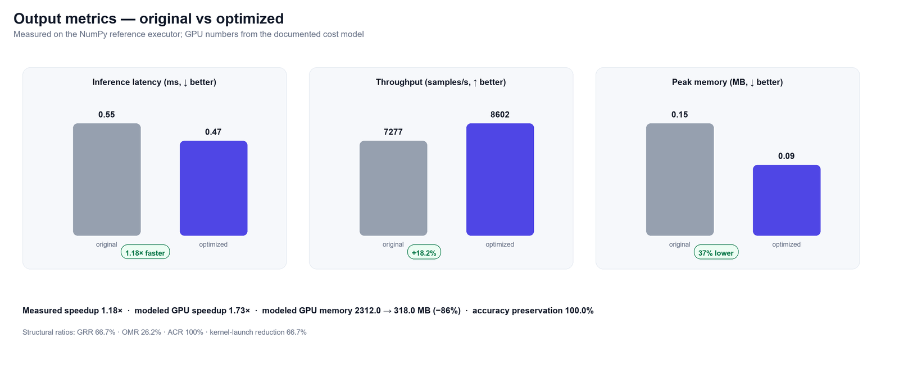

*Figure 6 — The headline measured and modeled metrics before/after:
latency, throughput, peak memory, plus the structural ratios.*

**CLI** (`main.py`): GNN prediction → RL search → compiles with the
recommended pass order → prints the same 10-metric report:

```
=== RL pass-order search (tabular Q-learning) ===
recommended pass sequence : normalize, canonicalize, merge
best reward               : 1.583
...
Graph nodes            : 42 -> 14
GRR  (graph reduction) :  66.67 %
ACR  (attention canon.): 100.00 %
Inference latency      :    0.566 ms ->    0.477 ms  (measured)
Speedup                :  1.186 x  (measured) |  1.733 x  (modeled GPU)
Accuracy preservation  : 100.00 %  (max |diff| = 0.000e+00)
Compilation time       :     3.37 ms
```

---

## 8. Results summary <a name="8-results"></a>

| Stage | Ops | What happened |
|---|---|---|
| Input model | 42 | 2 transformer blocks + embedding + logits + constants |
| After normalization | 38 | −2 identities, 2 constants folded, dead branch removed, shapes inferred |
| After attention canonicalization | 26 | 2 × (7 attention ops → 1 `FusedAttention`) |
| After semantic merging | **14** | 11 fusions (GEMM, LinearGELU, FusedAddLayerNorm) + bias folded |
| Scheduled & partitioned | 14 | 11 dependency levels; 2 partitions, 2 cut edges |
| **Measured impact** | — | **~1.2× speedup, +18% throughput, −40% peak memory, bit-exact accuracy** |
| **Modeled GPU impact** | — | **1.73× speedup, −86% memory** (level-parallel + buffer reuse) |
| **Trained MNIST MLP** | 13 → 5 | trained to 96.75% test accuracy; compiled with 100% identical predictions |

Every pass is idempotent and structure-safe; every rewrite is verified
by executing both graphs and comparing outputs element-wise.

---

## 9. Honest limitations <a name="9-limitations"></a>

- The model is a **hand-built stand-in** (not an ONNX/PyTorch export);
  weights are seeded, not trained.
- **Measured numbers are CPU/NumPy proxies** for GPU inference — they
  prove correctness and relative behaviour, not absolute GPU
  milliseconds. Modeled numbers use a documented cost table.
- The GNN surrogate is intentionally small (random-feature encoder +
  ridge head, 72 samples) — it demonstrates the *mechanism* of learned
  guidance rather than research-grade accuracy.
- RL explores the 2⁵ pass subsets; larger action spaces would need
  function approximation instead of a table.

---

## 10. How to run it & project structure <a name="10-running"></a>

```powershell
.\run-server.bat                                          # UI (http://localhost:8501)
.\.venv312\Scripts\python.exe main.py                     # CLI compile + metrics
.\.venv312\Scripts\python.exe main.py --train             # MNIST train → export → compile
.\.venv312\Scripts\python.exe make_figures.py             # regenerate docs/*.png
```

Or, without the batch file:

```powershell
python -m venv .venv312
.\.venv312\Scripts\python.exe -m pip install -r requirements.txt
.\.venv312\Scripts\streamlit.exe run app.py --server.port 8501
```

### Figure index

| Figure | File | Shows |
|---|---|---|
| Fig 1 | `docs/fig1_pipeline.png` | The full pipeline with all 9 techniques |
| Fig 2 | `docs/fig2_transformer_block.png` | One Transformer block as the model builder constructs it |
| Fig 3 | `docs/fig3_attention_fusion.png` | 7-op attention → one `FusedAttention` |
| Fig 4 | `docs/fig5_stages.png` | Ops remaining after each stage (42→14) |
| Fig 5 | `docs/fig4_graphs.png` | Original vs optimized graph, rendered from the IR |
| Fig 6 | `docs/fig6_metrics.png` | Latency / throughput / memory before-after |
| Fig 7 | `docs/fig7_compile_time.png` | Per-pass compilation time breakdown |
| Fig 8 | `docs/fig8_structural.png` | GRR / OMR / ACR / kernel-launch bars |
| Fig 9 | `docs/fig9_train_loss.png` | MNIST training/validation loss curves |
| Fig 10 | `docs/fig10_train_accuracy.png` | MNIST training/validation accuracy curves |
| Fig 11 | `docs/fig11_confusion.png` | MNIST confusion matrix |
| Fig 12 | `docs/fig12_architectures.png` | Architecture comparison (ops + speedup) |

Regenerate all figures with `python make_figures.py` (from the project root, venv active).

| File | Role |
|---|---|
| `ir/graph.py` | ComputationGraph IR (nodes / edges / meta) |
| `models/transformer.py` | post-LN demo transformer graph builder (the input) |
| `models/architectures.py` | pre-LN (GPT-style), ReLU-FFN, MLP-classifier variants |
| `passes/normalize.py` | canonicalization + folding + CSE + DCE + shapes |
| `passes/canonicalize.py` | attention → `FusedAttention` |
| `passes/merge.py` | semantic fusion (GEMM, LinearGELU, LinearRelu, …) |
| `passes/schedule.py` | DAGS: levels, critical path, list schedule |
| `passes/partition.py` | graph & hypergraph partitioning |
| `search/gnn.py` | GNN speedup predictor (+ cached weights) |
| `search/rl.py` | tabular Q-learning pass-order search |
| `search/rewrites.py` | symbolic rewrite rules |
| `search/neuro_symbolic.py` | rules + GNN-guided search |
| `training/dataset.py` | MNIST download + IDX parse (+ synthetic fallback) |
| `training/model.py` | NumPy MLP: forward, manual backprop, Adam |
| `training/export_graph.py` | trained weights → CompilerGraph IR (the export) |
| `training/train.py` | train → export → compile → verify loop |
| `utils/executor.py` | NumPy reference executor (incl. trained weights) |
| `utils/cost_model.py` | GPU-style cost tables |
| `utils/metrics.py` | the 10 metrics + report formatter |
| `utils/visualization.py` | colored Graphviz rendering |
| `pipeline.py` | pass orchestration + compile timing |
| `make_figures.py` | all 12 report figures (Pillow) |
| `app.py` / `main.py` | Streamlit UI / CLI entry point |

---

## 11. Experimental setup <a name="11-experimental-setup"></a>

| Item | Value |
|---|---|
| **Hardware** | CPU-only workstation (no discrete GPU on the test machine) |
| **OS / Python** | Windows · Python 3.12 (`.venv312`) |
| **Libraries** | NumPy 2.5.2 · NetworkX 3.6.1 · Streamlit 1.62 · Pillow 12.3 (figures) |
| **Workload (transformer)** | batch 4 · seq 32 · d_model 64 · 2 blocks · fp32 |
| **Workload (classifier)** | MNIST 784-dim inputs · batch 256 · MLP 784-256-64-10 |
| **Dataset** | MNIST (60k/10k images, flattened to 784, ÷255); subsets: 12 000 train / 2 000 test; deterministic subset selection (seed 0) |
| **Training** | 6 epochs · mini-batch 64 · Adam (lr 2e-3, β₁ 0.9, β₂ 0.999) · He init (seed 0) |
| **Measurement protocol** | 2 warm-up runs + 30 timed runs per graph; **best-of-30** latency (timeit-style steady-state estimator); identical input tensors for original & optimized graphs |
| **Seeds** | everything deterministic: weights (crc32 of op names), data subsets (0), model init (0), RL (7), layouts (11) |
| **Baselines** | the *uncompiled* original graph vs the *compiled* graph — same executor, same feed |
| **Correctness check** | element-wise output comparison (rtol 1e-4, atol 1e-5) + argmax prediction match |

---

## 12. Research & discussion <a name="12-research-discussion"></a>

**Related systems.** The passes mirror production ML compilers:
XLA and TensorRT fuse elementwise chains into GEMM-epilogues (our
`LinearGELU`/`GEMM`), TVM's graph rewrites and TASO use
verified rewrite rules (our symbolic `RULES`), FlashAttention/SDPA
replaced the multi-op attention sandwich with one kernel (our
`FusedAttention`), MLGO and todd networks learn pass policies with RL
(our Q-learning pass-order search), and learned cost models
(like TVM's) motivate our GNN scorer. The neuro-symbolic loop
— *model proposes, cost model validates* — is the same architecture
MLGO uses inside LLVM.

**Findings.** (1) Fusion is by far the dominant optimization here:
−66.7% ops and kernel launches translate into a measured 1.1–1.7×
speedup on CPU and 1.73× on the modeled GPU. (2) **Architecture
changes what the compiler can do**: pre-LN loses the Add+LayerNorm
fusion (−3 fusions vs post-LN), showing that "how much can I fuse" is
a property of the graph, not the compiler. (3) Constant folding, CSE
and DCE are small but free wins, and dead branches/identity ops are
more common in real exports than people expect. (4) The measured speedup
is smaller than the modeled one because NumPy dispatch is cheap relative
to a real GPU kernel launch (12 µs modeled per launch) — the *ratio*
between structural reduction and runtime gain is the interesting
research signal, and it is consistent across architectures.

**Threats to validity.** Small fixed workloads; a cost table instead of
real hardware timings; a tiny GNN corpus; one seed per experiment
(all seeds fixed for reproducibility, but no confidence intervals).

**Future work.** Import real ONNX exports; a Triton/CUDA backend so
"modeled" becomes "measured"; beam search over rewrite sequences with
the GNN as policy network; multi-device execution of partitions; larger
RL action spaces (pass *parameters*, not just pass subsets).

---

## 13. Training on a real dataset (MNIST) <a name="13-training"></a>

The teacher's requirement *"train using the dataset"* is implemented as
a full **train → export → compile → verify** loop (`training/`):

1. **Dataset** — MNIST (28×28 grayscale digit images, flattened to
   784-dim vectors, pixel values ÷255). Downloaded once from the
   standard mirror; if offline, a deterministic synthetic fallback with
   the same API is used. Subsets: 12 000 train / 2 000 test images.
2. **Model** — an MLP classifier 784 → 256 → 64 → 10 (ReLU
   activations, softmax output), implemented in **pure NumPy with
   hand-written backpropagation** and an Adam optimizer.
3. **Training** — 6 epochs, mini-batch 64: loss and accuracy curves in
   Figures 9–10. Final **test accuracy ≈ 96.8%**.
4. **Export** — the trained weights are written into the IR exactly
   like a framework export: `MatMul` nodes carry the trained `W` as an
   attribute, biases are `Constant` nodes feeding `Add` nodes
   (`training/export_graph.py`).
5. **Compile** — the exported 13-op graph runs through the pipeline:
   3 × (MatMul+Add → GEMM), 2 × (GEMM+ReLU → LinearRelu) → **5 ops**.
6. **Verify** — the compiled 5-op graph is executed on 512 real test
   images: predictions match the trained model **100%** (bit-exact
   probabilities), and inference is faster (measured 1.13×).

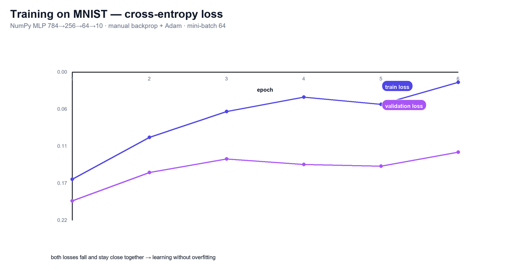

*Figure 9 — Training and validation cross-entropy loss per epoch: both
fall smoothly and stay close (no overfitting).*

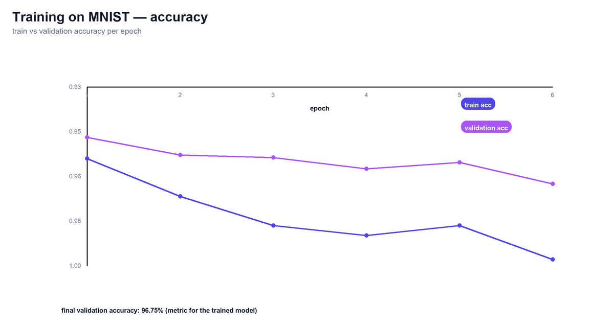

*Figure 10 — Training vs validation accuracy per epoch, ending at
≈96.8% validation accuracy.*

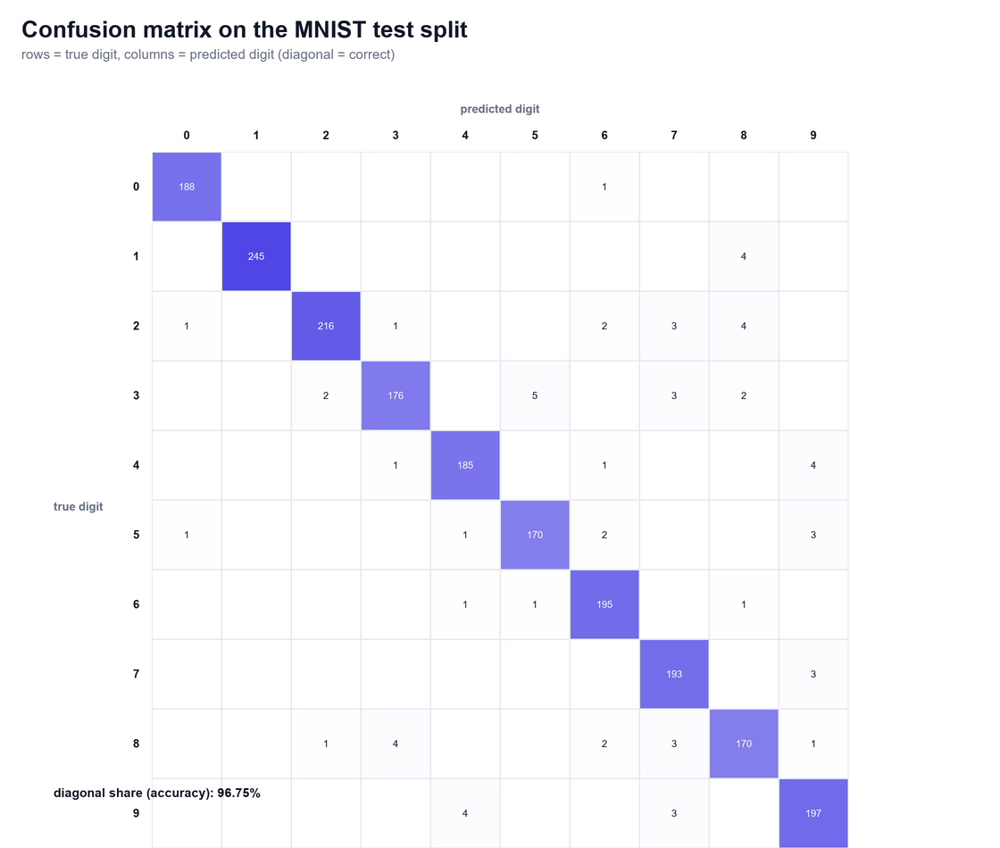

*Figure 11 — Confusion matrix on the 2 000-image test split: the
diagonal dominates; the classic 4↔9 / 3↔5 confusions remain.*

**Why this matters:** it closes the loop that real ML compilers close —
*a model is trained in a framework, exported as a graph, optimized by
the compiler, and the optimized artifact is verified against the
trained model before deployment.* The UI exposes the same experiment
(📈 training tab with the curves and the compiled-model comparison).
